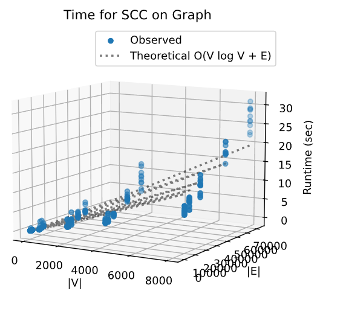
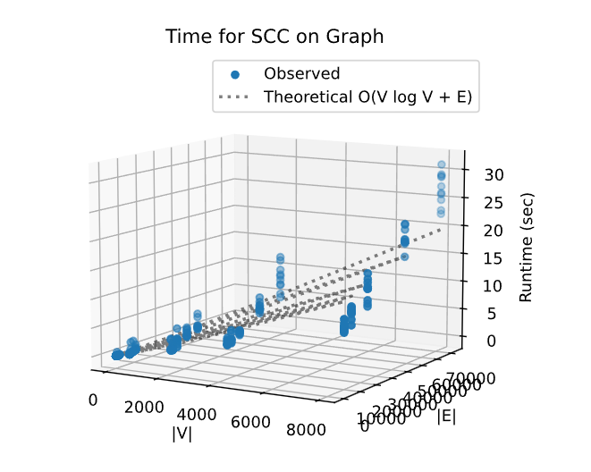

# Project Report - Network Analysis SCCs

## Baseline

### Design Experience

I talked with Caleb about the design. The core of the Baseline task is to implement the prepost function by initiating a depth first search in a deterministic order based on the keys, utilizing an increasing clock to record Pre times upon entry and Post times upon exit, while managing a visited set to prevent cycles and increasing recursion limit for deep graphs, ultimately producing a DFS forest that demonstrates linear $O(V+E)$ complexity in practice.

### Theoretical Analysis - Pre/Post Order Traversal

    def dfs(u, current_tree):
        nonlocal clock
        visited.add(u)

        clock += 1
        current_tree[u] = [clock, 0]  # 记录 Pre

        if u in graph:              # This inner loop runs once for every edge (E) in the graph
            for v in graph[u]:      # over the total duration of the algorithm.
                if v not in visited:
                    dfs(v, current_tree)

        clock += 1
        current_tree[u][1] = clock  # 记录 Post

    for node in graph.keys():       # This outer loop ensures we iterate over every vertex (V).
        if node not in visited:
            tree = {}
            dfs(node, tree)
            forest.append(tree)

    return forest

#### Time 

O(V+E)
The outer loop of the prepost function (for node in graph.keys()) iterates through every vertex $V$. Inside the DFS recursion, because we check if v not in visited before traversing, each edge $E$ in the graph is visited exactly once.

#### Space
O(V)
We have a visited set that stores at most $V$ nodes. In the worst-case scenario (such as a path graph), the DFS recursion stack can reach a depth of $V$. Additionally, the output forest stores the pre/post times for all $V$ nodes. Therefore, the dominant term is proportional to the number of vertices.

### Empirical Data

| Density | Size  | Time (sec) |
| ------- | ----- | ---------- |
| 0.25    | 10    | 0.005      |
| 0.25    | 50    | 0.018      |
| 0.25    | 100   | 0.037      |
| 0.25    | 500   | 0.189      |
| 0.25    | 2000  | 1.087      |
| 0.25    | 4000  | 1.78       |
| 0.25    | 8000  | 3.796      |
| 0.5     | 10    | 0.005      |
| 0.5     | 50    | 0.018      |
| 0.5     | 100   | 0.039      |
| 0.5     | 500   | 0.195      |
| 0.5     | 2000  | 1.034      |
| 0.5     | 4000  | 1.909      |
| 0.5     | 8000  | 5.93       |
| 1.0     | 10    | 0.005      |
| 1.0     | 50    | 0.018      |
| 1.0     | 100   | 0.043      |
| 1.0     | 500   | 0.248      |
| 1.0     | 2000  | 1.119      |
| 1.0     | 4000  | 2.289      |
| 1.0     | 8000  | 5.949      |
| 2.0     | 10    | 0.005      |
| 2.0     | 50    | 0.023      |
| 2.0     | 100   | 0.095      |
| 2.0     | 500   | 0.286      |
| 2.0     | 2000  | 1.483      |
| 2.0     | 4000  | 4.842      |
| 2.0     | 8000  | 10.324     |
| 3.0     | 10    | 0.005      |
| 3.0     | 50    | 0.024      |
| 3.0     | 100   | 0.046      |
| 3.0     | 500   | 0.336      |
| 3.0     | 2000  | 1.788      |
| 3.0     | 4000  | 4.648      |
| 3.0     | 8000  | 12.745     |


### Comparison of Theoretical and Empirical Results

- Theoretical order of growth: $O(V + E)$, liner
- Empirical order of growth (if different from theoretical): The empirical data  supports the theoretical complexity in low densities, but shows some deviation at higher densities.

[img](base.png)

Although the algorithm is theoretically linear, the observed supralinear growth in dense graphs is likely due to system overhead distinct from algorithmic complexity.

## Core

### Design Experience

We discussed using Kosaraju’s Algorithm to find Strongly Connected Components. The basic steps is to perform a full DFS pass to record the finishing times of nodes in a stack. Then construct the transpose graph, nd then processing nodes by popping them from stack, do it post-order. My partner stated the assignment require Sink-to-Source, so we still need to alter the final list.

### Theoretical Analysis - SCC
```
    for node in graph.keys():         # because we visit each node and edge once.
        if node not in visited:
            dfs_pass1(node)

reversed_graph = {u: [] for u in graph}     # iterate over all keys V and all adjacency lists E.
    for u in graph:
        for v in graph[u]:
            if v not in reversed_graph:
                reversed_graph[v] = []
            reversed_graph[v].append(u)
            
            
   def dfs_pass2(u, current_component):     #pop V nodes, and inner DFS traverses edges in reversed_graph.
        visited_scc.add(u)
        current_component.add(u)
        if u in reversed_graph:
            for v in reversed_graph[u]:
                if v not in visited_scc:
                    dfs_pass2(v, current_component)            
```
#### Time 

 $O(V + E)$

he algorithm consists of three linear passes. A DFS traversal visits every node and edge once. Then building the reversed graph requires iterating over every nodes and edges. The second traversal also visits every node and edge reversely.
#### Space

 $O(V + E)$

We need to store the reversed graph, which contains a new adjacency list for all $V$ nodes and $E$ edges. We also maintained two visited sets visited and visited_scc, and a post_order_stack, all of this scale with $V$. The dominant factor is the storage of the reversed graph. 
### Empirical Data


| Density | Size  | Time (sec) |
| ------- | ----- | ---------- |
| 0.25    | 10    | 0.01       |
| 0.25    | 50    | 0.041      |
| 0.25    | 100   | 0.087      |
| 0.25    | 500   | 0.427      |
| 0.25    | 2000  | 1.849      |
| 0.25    | 4000  | 3.665      |
| 0.25    | 8000  | 7.559      |
| 0.5     | 10    | 0.009      |
| 0.5     | 50    | 0.038      |
| 0.5     | 100   | 0.09       |
| 0.5     | 500   | 0.553      |
| 0.5     | 2000  | 2.025      |
| 0.5     | 4000  | 3.857      |
| 0.5     | 8000  | 8.471      |
| 1.0     | 10    | 0.009      |
| 1.0     | 50    | 0.044      |
| 1.0     | 100   | 0.099      |
| 1.0     | 500   | 0.445      |
| 1.0     | 2000  | 2.173      |
| 1.0     | 4000  | 4.825      |
| 1.0     | 8000  | 10.801     |
| 2.0     | 10    | 0.011      |
| 2.0     | 50    | 0.051      |
| 2.0     | 100   | 0.403      |
| 2.0     | 500   | 0.738      |
| 2.0     | 2000  | 3.134      |
| 2.0     | 4000  | 6.937      |
| 2.0     | 8000  | 20.312     |
| 3.0     | 10    | 0.01       |
| 3.0     | 50    | 0.072      |
| 3.0     | 100   | 0.146      |
| 3.0     | 500   | 0.923      |
| 3.0     | 2000  | 4.034      |
| 3.0     | 4000  | 11.051     |
| 3.0     | 8000  | 26.727     |


### Comparison of Theoretical and Empirical Results

- Theoretical order of growth: *copy from section above* 
- Empirical order of growth (if different from theoretical): At Density 0.25, the algorithm behaves almost exactly as predicted. At Density 3.0, the growth rate is higher than expected.
- Comparing Size 4000 ($11.051s$) to Size 8000 ($26.727s$),  $26.727 / 11.051 \approx 2.42$.
- The runtime increased by a factor of $2.42$, which is noticeably higher than the expected factor of 2.


(somehow the generated empirical.svg is almost the same like last one.)


The supralinear growth in dense graphs is likely due to the Memory & Graph Construction Overhead specific to the Core implementation. Because with size 8000 and high density, the graph data structure is too large to fit in the cache. The algorithm must constantly fetch data, which creates a significant bottleneck compared to smaller sizes.

## Stretch 1

### Design Experience
I implemented classify_edges by utilizing the pre post order timestamps generated from the DFS traversal, merged the DFS forest into a single lookup dictionary. Then, we iterated through every edge $(u, v)$ in the graph and compared the time intervals $[pre_u, post_u]$ and $[pre_v, post_v]$. Based on the logic of nested intervals imply an ancestor-descendant relationship (Tree/Forward or Back edges), while disjoint intervals imply a Cross edge.

### Articulation Points Discussion 

An Articulation Point is a node in a graph whose removal increases the number of connected components. It acts as a single point of failure or a mandatory bridge between different parts of a network.
Here are some real-world examples where identifying articulation points is used:

1. Supply Chain & Distribution Networks
Nodes can represent factories, warehouses, and retail stores. Edges represent the transportation routes for trucks, ships and planes.  A specific Regional Distribution Center that serves as the only link between manufacturing plants in one country and retail outlets in another region.  Identifying this RDC as an articulation point highlights a critical vulnerability in the supply chain. If this center shuts down it will decrease the efficiency and cause the stouckouts downstream.

2. Disease Spread & Epidemiology
In epidemiology, identifying articulation points is vital for containment strategies. If a node is an articulation point, quarantining or immunizing that specific node can effectively cut the spread, preventing the virus from spreading from the infected cluster to the rest of the population. It allows health officials to prioritize limited resources where they will have the most significant impact on stopping transmission. Nodes can represent each individual or communities and even cities. Edges represent possible spreads of diseases physical contact, transportation routes like flights, ships and trains. Articulation Point can be  a "Super-spreader" or a Major Transit Hub, like an airport, connecting an infected region to an uninfected region. 

## Stretch 2

### Design Experience

Caleb gave me some suggestions for adapting the real-world wikiRfA.csv dataset. Since the raw file contains SOURCE, TARGET, and VOTE columns, he suggested me to filter the data to include only positive votes (Vote=1). This allows us to construct a "Trust Network" rather than a graph of conflicts. Since the rest of the function was written in scc.py, I only need to print the data it get, I also tried to visualize the steps.
### Dataset Description

Name: Wikipedia Requests for Adminship (wikiRfA.csv)
Source: Stanford Network Analysis Project (SNAP) / Kaggle

Description: The dataset represents the voting network for Wikipedia administrator elections.

Nodes: 10,010 (Wikipedia Users/Editors).

Edges: 143,879 (Directed edges representing a Support Vote, VOTE=1).

Meaning: User means Node. A directed edge from a User to another User means User A voted in favor of User B becoming an administrator.
### Findings Discussion

I tried both the Kosaraju SCC Algorithm and the Edge Classification Algorithm on the dataset. The algorithm identified one massive SCC containing 2,224 nodes. Which means there is a cyclic 'path of trust' connect every User in this circle, represents the "Inner Circle" of the Wikipedia administration. This analysis confirms a "Core-Periphery" structure. It suggest the administration hierarchical. To have influence to be in the SCC, one must participate in the reciprocal voting. The SCC algorithm successfully separated the established power figures (the 2224 nodes) from the transient participants.

## Project Review

In this project, I bridged the gap between theoretical graph algorithms and practical software engineering. I learned Implementing Kosaraju’s Algorithm validated the power of $O(V+E)$ complexity. Even when processing the Stretch 2 dataset with over 140,000 edges, the algorithm finished in a short time. This contrasted sharply with the empirical runtimes at high densities in the Core section, teaching me that while algorithmic complexity determines the trend, system overhead  dominates the actual runtime constants. While working on Stretch 2. The combination of SCC analysis and Edge Classification provided deep insights. Finding that 30%+ of the edges in the Wiki dataset were Back Edges gave a mathematical explanation for the existence of the giant "Core" component. It demonstrated how abstract graph properties (cycles) directly map to social behaviors.
